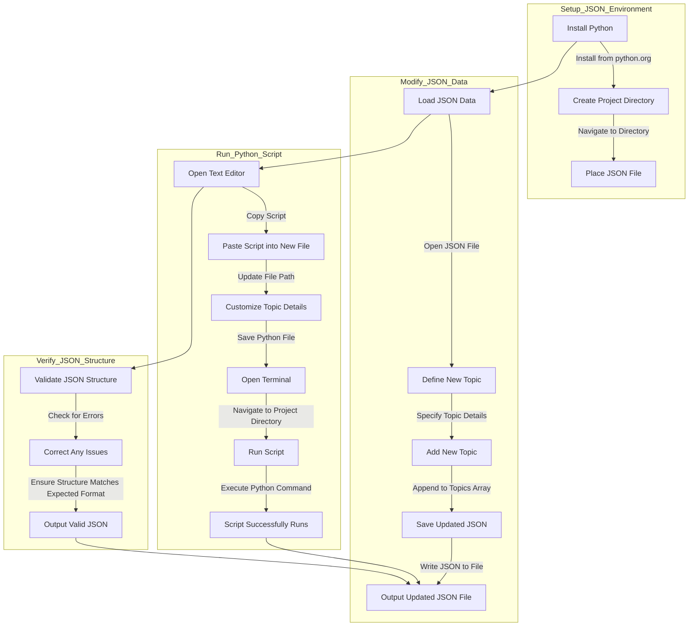

# Assistable documentation for AI ingest - by Prompted LLC

Documentation and transcripts redesigned as json for knowledge source files

## Json Structure Diagram

Careful adding new content to a json file. You need to do so in accordance with the existing structure or it will break it and cause syntax errors. 

```
{
  "Assistable": {
    "topics": [
      {
        "Billing": [
          // Billing content here
        ]
      },
      {
        "Chat AI Buildout": [
          // Chat AI Buildout content here
        ]
      },
      {
        "Voice AI Buildout": [
          // Voice AI Buildout content here
        ]
      }
    ]
  }
}

```

## File and contents

Currently have three topics nested: 

- Billing
- Chat AI Buildout
- Voice AI Buildout
- More to come

[assistable_docs_partial_array.json](https://prod-files-secure.s3.us-west-2.amazonaws.com/4b0e7490-e0f4-4748-b04e-4d572bf62586/dbd4cfb9-1351-4437-a2fc-542e3f64a9f5/assistable_docs_partial_array.json)

```json
{
  "Assistable": {
    "topics": [
      {
        "Billing": [
          {
            "title": "Introduction",
            "content": "This document provides detailed instructions for setting up and using the rebilling feature in your admin portal. It covers setup steps, client perspectives, and the functionality of the rebilling feature."
          },
          {
            "title": "Setup",
            "content": {
              "Accessing Rebilling": "Navigate to your admin portal and click on 'Rebilling' to access the setup area.",
              "Connecting to Stripe": "A Stripe connection is required to handle payments. Follow the automated onboarding process to connect your Stripe account. If additional documentation is required, the onboarding process will guide you through it."
            }
          },
          {
            "title": "Dashboard Overview",
            "content": "Once connected to Stripe, your dashboard will display the following metrics: Monthly Recurring Revenue (MRR), Gross Volume, and Net Volume."
          },
          {
            "title": "Activating Rebilling",
            "content": "Turn on rebilling by clicking the 'Turn On' button. This activates the feature across all sub-accounts."
          },
          {
            "title": "Product Catalog",
            "content": {
              "Creating Products": {
                "Subscription Plans": "Create subscription plans with specific names, prices, and included features.",
                "Voice Minutes": "Create voice minute plans with specific costs per minute and minute allocations."
              },
              "Managing Products": "Products can be activated or deactivated as needed. Use the 'Add Product' button to create and configure new plans."
            }
          },
          {
            "title": "Client Perspective",
            "content": {
              "Client Portal Access": "Clients will see available subscription and voice minute plans. For voice minutes, clients can purchase directly, with costs added to their accounts and payments handled via Stripe.",
              "Managing Subscriptions": "Clients can choose, manage, and view details of their subscription plans, including trial periods and transaction history."
            }
          },
          {
            "title": "Functionality",
            "content": {
              "Handling Payments": "Payments are shown in the Payments tab, detailing transaction amounts, customer information, associated sub-accounts, and metadata for each transaction. Refunds and payment management can be handled through this portal.",
              "Sub-Account Management": "Connect sub-accounts and set up customer IDs within Stripe. Ensure rebilling is enabled to access voice minutes or subscription plans."
            }
          },
          {
            "title": "Example Workflows",
            "content": {
              "Creating a Voice Minute Plan": "Navigate to 'Add Product.' Select 'Voice Minutes.' Set the plan details (e.g., 21 cents per minute for 1,000 minutes). Activate the plan to make it visible in the client portal.",
              "Creating a Subscription Plan": "Navigate to 'Manage Subscription Plans.' Configure the plan with: Name, Monthly price, Included messages and assistants, Optional trial days. Activate the plan."
            }
          },
          {
            "title": "Managing Clients",
            "content": {
              "Client Actions": "Clients create accounts, select plans, and enter payment information. They can manage subscriptions, purchase additional voice minutes, and view transaction history.",
              "Billing and Transactions": "All billing information and transactions are managed through Stripe. Clients’ payments are processed and reflected in your Stripe Marketplace account."
            }
          },
          {
            "title": "Features",
            "content": [
              "You can use either/both/none based on your deployment.",
              "Show/hide products and turn rebilling off or on.",
              "See transaction history and associated accounts.",
              "Managed through Stripe marketplace - voice is drop-serviced with cost (so you don't have to buy in bulk, you get the difference) and subscriptions are all yours.",
              "These are managed inside the GHL custom menu link iframe for full white label.",
              "Set trial days.",
              "Client portal management | Admin portal management."
            ]
          },
          {
            "title": "Things to Come",
            "content": [
              "Webhooks for payments (for follow-up, record-keeping, or whatever you would like).",
              "Auto-billing for usage.",
              "Turn off for specific subaccounts | opt specific subaccounts out.",
              "Onboarding flow.",
              "This infrastructure for resellers (external deployments).",
              "And more..."
            ]
          },
          {
            "title": "Troubleshooting and Support",
            "content": "If issues arise, support is available through the dedicated support channels. Detailed help articles and initial feedback mechanisms are in place to continuously improve the feature."
          }
        ]
      },
      {
        "Chat AI Buildout": [
          {
            "title": "Assistable.ai Comprehensive Chat AI Setup [A-Z]",
            "content": [
              {
                "title": "Introduction",
                "content": "A - Z Setup w/ Full Walkthrough: Please watch this, I know it's 50 minutes (36.5 mins on 1.5x speed) out of your day but it will answer 99% of your questions on settings up assistants and also give you some insight on what everything does, how to use it, and how to get advanced with use as well :)"
              },
              {
                "title": "Loom Video",
                "content": "Loom Showing Step-By-Step: https://www.loom.com/share/d9791c0838934978a83b12e0f813778a?sid=8b5f6045-9620-4763-94ef-150f26e295a8"
              },
              {
                "title": "Prompt",
                "content": "The prompt in the video is below for you to copy, but use the Assistable.ai prompt engineering guide to level up your AI: https://assistable.ai/help-center/?help-doc=1719825599974x747504183991074800"
              },
              {
                "title": "Steps",
                "content": [
                  {
                    "step": "1. Create a knowledge base",
                    "details": [
                      "a. Click on the Knowledge tab and click create knowledge base",
                      "b. Click configure to configure your knowledge base",
                      "c. [Not required but recommended] Click on add knowledge and input company data either through text, files, or scraping a URL",
                      "i. Input company information, FAQs, Objection handling, sales material and more to embed the AI with knowledge",
                      "d. [Required for booking] Sync your GoHighLevel calendars, choose the calendar you want the assistant to use for booking"
                    ]
                  },
                  {
                    "step": "2. Create a chat assistant [all inputs recommended]",
                    "details": [
                      "a. Click on the Assistants tab, click create assistant, choose chat assistant, and click New Assistant (Blank Canvas)",
                      "b. Click Configure to Configure your assistant",
                      "c. Configuration:",
                      "i. Internal name (a name you will reference internally, this will not be used by the AI)",
                      "ii. Assistant name (this is the name the assistant knows as its own)",
                      "iii. Language (while LLMs can switch languages, this just tells the assistant its native language)",
                      "iv. Personality (reflecting your business’s brand)"
                    ]
                  },
                  {
                    "step": "3. Go to the Active Tags Tab",
                    "details": [
                      "a. Active tags are what tells your assistant they are able to converse with the lead or not",
                      "i. TAG ON: The assistant will actively respond and work in that conversation",
                      "ii. TAG OFF: The assistant will not actively respond and just “listen” to the conversation to learn and build a profile around the contact",
                      "b. Create an active tag",
                      "c. Name the tag",
                      "d. Add the assistant to the tag by selecting the dropdown",
                      "e. Add a unique tag for your assistant to recognize",
                      "i. These tags are automatically created / deleted for you in GoHighLevel so you do not have to double work",
                      "f. Save Changes"
                    ]
                  },
                  {
                    "step": "4. Add the tag to a contact, initiate the conversation and your assistant will take over the conversation after a response from the lead",
                    "details": [
                      "a. How does the assistant initiate the conversation? Well, it doesn’t - that is what workflows are for. An AI is great at a lot of things, but no one knows your customer and business like you. You know where your leads are coming from, build a campaign around those channels and add the assistant tag so you’re getting comprehensive coverage and AI will take those leads that respond.",
                      "b. My assistant said X and i don’t want it to: Tell it not to say that / vise versa",
                      "c. What is the best way to prompt/build goals/states? Task based frameworks are the BEST way to prompt ANY AI to do exactly what you want it to - examples of the ones I use are below.",
                      "d. My assistant is not booking: 2 Things.. Check your GoHighLevel calendar to see if it is active and there are actually available time slots to book to (permanent calendar link), if that is good - Delete your calendar in the knowledge base and resync them. Sometimes GHL calendar data gets corrupted overtime - reset usually does the trick."
                    ]
                  },
                  {
                    "step": "5. You should be good to go. Give it some trial and error and remember AI is never going to be perfect, but we give you the tools to get it as close as possible. Experiment, try new things, remember the basics and have FUN.",
                    "details": [
                      "BEST PRACTICES:",
                      "1. Less is ALWAYS more. If you can convey your task in a simpler way - do it. AI is really no different than a human, if you instruct in an unclear manner, AI will react in an unclear manner. Be concise, be direct.",
                      "2. Use task-based frameworks. AI understands things in tasks. It was created to do tasks for humans, so giving it a proper framework will allow it to feel right at home in doing its job.",
                      "3. Reference the proper roles in an AI convo. AI doesn't know about leads, lead, contact, customers, etc etc… AI knows user - not users - but user. AI thinks in a 1 dimensional mindset, it doesn’t understand there are users out there all talking with it - it knows it's talking to the user right now, right here.",
                      "4. Talk to the AI like a VA / Employee. When prompting / setting goals, talk to the AI in first person mode - that's how they are created to understand - instruction. So, instead of saying A, we use B.",
                      "a. We need to ask our leads how much money they make",
                      "b. Ask the user how much money they make",
                      "5. Lastly - simplify, simplify, simplify. A lot of people write really long prompts, the short, simpler, concise, easier your prompt is. The better the AI interaction is. Don’t go crazy :)"
                    ]
                  }
                ]
              }
            ]
          }
        ]
      },
      {
        "Voice AI Buildout": [
          {
            "title": "Assistable.ai Comprehensive Voice AI Setup [A-Z]",
            "content": [
              {
                "title": "Introduction",
                "content": "Voice A - Z Setup w/ Full Walkthrough: Please watch this, I know it's 50 minutes out of your day but it will answer 99% of your questions on setting up voice assistants and also give you some insight on what everything does, how to use it, and how to get advanced with use as well :)"
              },
              {
                "title": "Youtube Video",
                "content": "Youtube Showing Step-By-Step: https://youtu.be/Yn6toYydrW0"
              },
              {
                "title": "Prompt",
                "content": "The prompt in the video is below for you to copy, but use the Assistable.ai prompt engineering guide to level up your AI: https://assistable.ai/help-center/?help-doc=1719825599974x747504183991074800"
              },
              {
                "title": "Steps",
                "content": [
                  {
                    "step": "1. Create a voice assistant [all inputs recommended]",
                    "details": [
                      "a. Click on the Assistants tab, click create assistant, choose outbound + inbound assistant, and accept the compliance disclosure and create your assistant.",
                      "b. Click Configure to Configure your assistant",
                      "c. Configuration:",
                      "i. Personality Prompt: This is the system prompt or the global prompt for the assistant to use. Remember, keep it simple and don’t over-complicate - I care about you a lot so I pre-fill all of the stuff you need and I included the one from the video below :)",
                      "ii. Opt out of data: If you require regulation of data such as hipaa, turn this on. This will delete / not store transcripts and recordings - after 10 minutes they will be deleted to be compliant. I keep mine off because data = good",
                      "iii. Ambient Noise: This is noise that will play in the background of the call to breakup latency and also seem a bit more human with a white-noise in the background.",
                      "iv. Select Voice:This is where you can select the voice for your voice assistant. You can see the library of voices, their accent, their gender, and their age. Select one here - I personally use Emily.",
                      "v. Select Language: This is the setting for the Speech-to-Text to better pick up the language of your customers for transcripts, LLM response and conversation data. My main market is the US so English (US) for me.",
                      "vi. Responsiveness: Controls the speed of response - think of this like queuing. At 1, the AI will respond as fast as possible and closer to 0 will add some latency. I keep mine on 1.",
                      "vii. Interruption Sensitivity: This sets a parameter of sensitivity for the human (user) interrupting the AI. For example, at 1 - if the AI is talking and the human (user) interrupts, the AI will stop talking after a couple words of their interruption. At 0 - the AI will not let the human interrupt them. I keep mine on 1.",
                      "viii. Voice Speed: Pretty self-explanatory but controls the speed of the voice as a multiplier. Just like a Loom or Youtube video, right? 2 speed will be like playing a video at 2x speed, and 0.85 will be like playing a video at 0.85x speed. I keep mine on 0.9 - 0.85.",
                      "ix. Voice Temperature: This controls emotion. 2 will be a highly emotional voice (and also adds latency for processing), and 0 will be robotic. I keep mine on 1.2",
                      "x. Enable Backchannel: Like a chat interim message right? As the human talks, the AI will affirm things like “yeah”, “uh-huh”, “ok” - just like we as humans do when talking with each other. I keep this on.",
                      "xi. AI Model: The AI model to do the response generation. I ALWAYS keep mine on GPT-4o - just a great balance between latency, responses, and reliability.",
                      "xii. Greeting Rules: Just sets the tone for the start of the conversation. AI initiates allows the AI to start the convo and take control, Contact initiates means the AI will wait for the contact to speak before it starts, and define allows you to build a deterministic start to the call. I keep mine on AI initiates dynamically - because AI is smarter and better than me."
                    ]
                  },
                  {
                    "step": "2. Go to the Phone Number tab",
                    "details": [
                      "a. Select Buy Number",
                      "b. Select the assistant you just created to link it",
                      "c. Put in your desired area code for the number",
                      "i. If the number is available, it will be bought and made available to your assistant to use and a $2.50 subscription will start",
                      "ii. If the number is not available, there is an error that will show and the number will not be purchased.",
                      "d. Once you find a number and it is purchased, the link will automatically be made and you’re good to go"
                    ]
                  },
                  {
                    "step": "3. Making Calls",
                    "details": [
                      "a. Inbound call: Pretty self explanatory but if someone calls the inbound number, the linked/select assistant will pick up and converse.",
                      "b. Outbound call:",
                      "i. Copy the assistant ID in the top left hand corner of the assistant configuration",
                      "ii. Go to Automations in GoHighLevel and create a workflow or go to your current workflow where you want to add an outbound call",
                      "iii. Add a workflow action - Assistant Outbound Call. Should be at the very bottom of workflow actions. If you don’t see it, your oauth is not connected or outdated so reset your Admin Oauth.",
                      "iv. Input your copied assistant ID and for the intro message, just input a dash (-). That field is for the transient AIs (international - not this voice)",
                      "v. Run a contact through the workflow and if you set it up correctly, an outbound call will be made to contact"
                    ]
                  },
                  {
                    "step": "4. You should be good to go. Give it some trial and error and remember AI is never going to be perfect, but we give you the tools to get it as close as possible. Experiment, try new things, remember the basics and have FUN.",
                    "details": [
                      "BEST PRACTICES:",
                      "1. Less is ALWAYS more. If you can convey your task in a simpler way - do it. AI is really no different than a human, if you instruct in an unclear manner, AI will react in an unclear manner. Be concise, be direct.",
                      "2. Use task-based frameworks. AI understands things in tasks. It was created to do tasks for humans, so giving it a proper framework will allow it to feel right at home in doing its job.",
                      "3. Reference the proper roles in an AI convo. AI doesn't know about leads, lead, contact, customers, etc etc… AI knows user - not users - but user. AI thinks in a 1 dimensional mindset, it doesn’t understand there are users out there all talking with it - it knows it's talking to the user right now, right here.",
                      "4. Talk to the AI like a VA / Employee. When prompting / setting goals, talk to the AI in first person mode - that's how they are created to understand - instruction. So, instead of saying A, we use B.",
                      "a. We need to ask our leads how much money they make",
                      "b. Ask the user how much money they make",
                      "5. Lastly - simplify, simplify, simplify. A lot of people write really long prompts, the short, simpler, concise, easier your prompt is. The better the AI interaction is. Don’t go crazy :)"
                    ]
                  }
                ]
              }
            ]
          }
        ]
      }
    ]
  }
}
```

## Adding info to the json file

JSON can be tricky to modify as there are a ton of nested structures that must be observed in order to maintain the integrity of the structure. I plan to add more documentation and make it more comprehensive. 

But if you want to add to it yourself, you can use a script that does the following: 



This script will read the JSON file, add new topics, and then write the updated JSON back to the file.

### Python Script to Add Topics

```python
import json

def load_json(file_path):
    with open(file_path, 'r') as file:
        return json.load(file)

def save_json(data, file_path):
    with open(file_path, 'w') as file:
        json.dump(data, file, indent=4)

def add_topic(data, topic_name, topic_content):
    # Check if 'Assistable' and 'topics' exist in the data
    if 'Assistable' in data and 'topics' in data['Assistable']:
        # Create the new topic structure
        new_topic = {
            topic_name: topic_content
        }
        # Append the new topic to the list of topics
        data['Assistable']['topics'].append(new_topic)
    else:
        print("Invalid data structure")
    return data

# Example usage
file_path = '/mnt/data/assistable_docs_partial_array.json'
data = load_json(file_path)

# Define new topic content
new_topic_name = "New Topic"
new_topic_content = [
    {
        "title": "Introduction",
        "content": "This is an introduction to the new topic."
    },
    {
        "title": "Details",
        "content": "These are the details of the new topic."
    }
]

# Add the new topic
data = add_topic(data, new_topic_name, new_topic_content)

# Save the updated JSON
save_json(data, file_path)

```

### Explanation

1. **load_json(file_path)**: This function loads the JSON data from a file.
2. **save_json(data, file_path)**: This function saves the JSON data to a file with proper formatting.
3. **add_topic(data, topic_name, topic_content)**: This function adds a new topic to the `topics` array. It checks if the necessary structure (`Assistable` and `topics`) exists in the data.
4. **Example usage**: Demonstrates how to use the functions to load the JSON, add a new topic, and save the updated JSON.

Adjust the `new_topic_name` and `new_topic_content` variables to add different topics. Run this script to add new topics to your JSON file.

<aside>
🔥 I will add more to this soon. In the meantime, if you want to add content to it without breaking the file structure, you can use the prompt below and upload the file above to chatgpt for assistance.

</aside>

### Prompt to ask chatgpt to use the script below

```
### Instructions for Updating, Adding to, and Modifying JSON Data

#### JSON Structure
The JSON data is structured as follows:
- **Assistable**: The top-level dictionary containing an array of topics.
- **topics**: An array where each element is a dictionary representing a topic. Each topic is itself a dictionary with the topic name as the key and an array of content items as the value.
  - **Content items**: Each item in the array is a dictionary with `title` and `content`.

Example structure:
```json
{
  "Assistable": {
    "topics": [
      {
        "Billing": [
          {
            "title": "Introduction",
            "content": "This document provides detailed instructions for setting up and using the rebilling feature in your admin portal."
          },
          ...
        ]
      },
      {
        "Chat AI Buildout": [
          {
            "title": "Assistable.ai Comprehensive Chat AI Setup [A-Z]",
            "content": [
              {
                "title": "Introduction",
                "content": "A - Z Setup w/ Full Walkthrough: Please watch this video."
              },
              ...
            ]
          }
        ]
      },
      {
        "Voice AI Buildout": [
          {
            "title": "Assistable.ai Comprehensive Voice AI Setup [A-Z]",
            "content": [
              {
                "title": "Introduction",
                "content": "Voice A - Z Setup w/ Full Walkthrough: Please watch this video."
              },
              ...
            ]
          }
        ]
      }
    ]
  }
}
```

#### Task
You need to update, add to, and/or modify the JSON data file. Follow these steps to accomplish this task:

1. **Install Dependencies**: Ensure you have Python installed. If not, install it from [python.org](https://www.python.org/downloads/).
2. **Read and Write JSON Data**: Use the provided Python script to read the existing JSON file, update it, and save the changes.

#### Python Script
Below is the script you need to rewrite and run in your environment. This script allows you to load the JSON data, add a new topic, and save the updated JSON data.

```python
import json

# Function to load JSON data from a file
def load_json(file_path):
    with open(file_path, 'r') as file:
        return json.load(file)

# Function to save JSON data to a file
def save_json(data, file_path):
    with open(file_path, 'w') as file:
        json.dump(data, file, indent=4)

# Function to add a new topic to the JSON data
def add_topic(data, topic_name, topic_content):
    # Check if 'Assistable' and 'topics' exist in the data
    if 'Assistable' in data and 'topics' in data['Assistable']:
        # Create the new topic structure
        new_topic = {
            topic_name: topic_content
        }
        # Append the new topic to the list of topics
        data['Assistable']['topics'].append(new_topic)
    else:
        print("Invalid data structure")
    return data

# Example usage
file_path = 'assistable_docs_partial_array.json'  # Update this path to the location of your JSON file
data = load_json(file_path)

# Define new topic content
new_topic_name = "New Topic"  # Replace with the actual name of the new topic
new_topic_content = [
    {
        "title": "Introduction",
        "content": "This is an introduction to the new topic."
    },
    {
        "title": "Details",
        "content": "These are the details of the new topic."
    }
]

# Add the new topic
data = add_topic(data, new_topic_name, new_topic_content)

# Save the updated JSON
save_json(data, file_path)
```

#### Steps to Run the Script
1. **Set Up Your Environment**:
   - Ensure you have Python installed.
   - Create a new directory for this task and navigate to it.
   - Place your existing JSON file (e.g., `assistable_docs_partial_array.json`) in this directory.

2. **Run the Script**:
   - Open a text editor or IDE (e.g., VS Code, PyCharm).
   - Copy the provided script into a new Python file (e.g., `update_json.py`).
   - Update the `file_path` variable in the script to point to your JSON file.
   - Customize the `new_topic_name` and `new_topic_content` variables as needed.
   - Save the Python file.
   - Open a terminal or command prompt, navigate to your directory, and run the script using the command:
     ```sh
     python update_json.py
     ```

By following these instructions, you will be able to update, add to, and modify the JSON data file successfully. If you encounter any issues, please ensure your JSON structure matches the expected format and that the file paths are correct.

---
